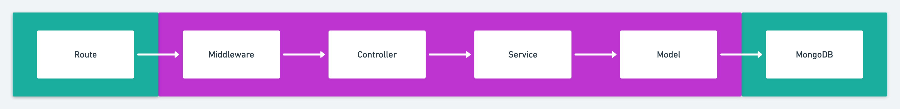

# Testing Express REST API

## Key takeaways
* An understanding of how important testing is
* Testing doesn't have to be complicated or difficult

## What will you learn?
* Testing a REST API end-to-end with Supertest & mongodb-memory-server
* Mocking services
* Testing from the controller to the service

Read: https://github.com/goldbergyoni/javascript-testing-best-practices

## What you will need
* Clone this repository: https://github.com/TomDoesTech/REST-API-Tutorial-Updated
* An IDE or text editor (VS Code)
* A package manager such as NPM or Yarn
* Node.js installed

## What next?
* ~~Testing the API with Jest~~
* Build a React.js user interface
* Add Prometheus metrics to the API
* Deploy the API with Caddy & Docker
* Add Google OAuth

## Data flow

## Let's keep in touch
- [Subscribe on YouTube](https://www.youtube.com/TomDoesTech)
- [Discord](https://discord.gg/4ae2Esm6P7)
- [Twitter](https://twitter.com/tomdoes_tech)
- [TikTok](https://www.tiktok.com/@tomdoestech)
- [Facebook](https://www.facebook.com/tomdoestech)
- [Instagram](https://www.instagram.com/tomdoestech)

[Buy me a Coffee](https://www.buymeacoffee.com/tomn)

[Sign up to DigitalOcean 💖](https://m.do.co/c/1b74cb8c56f4)
